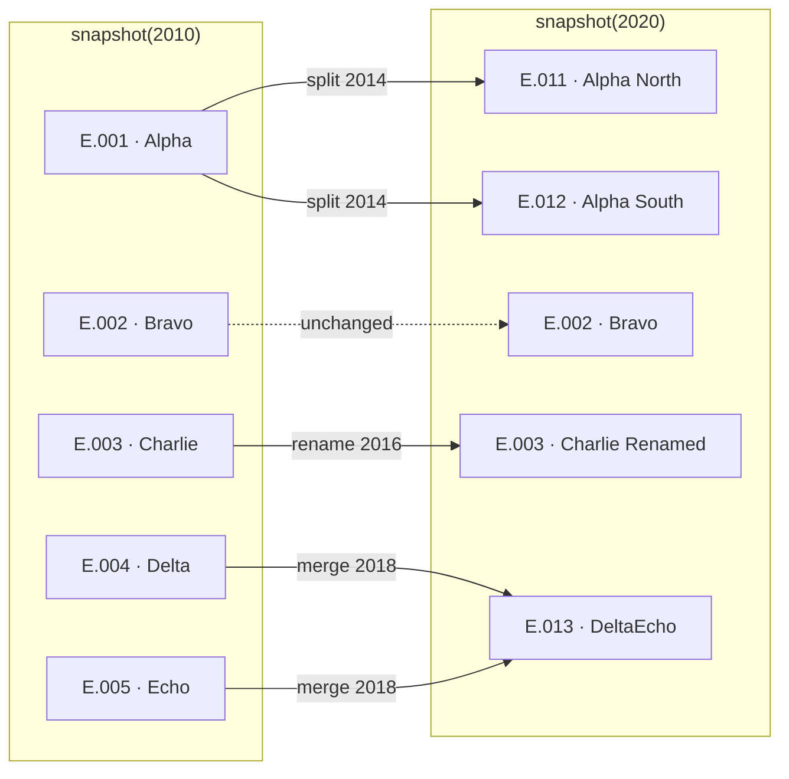
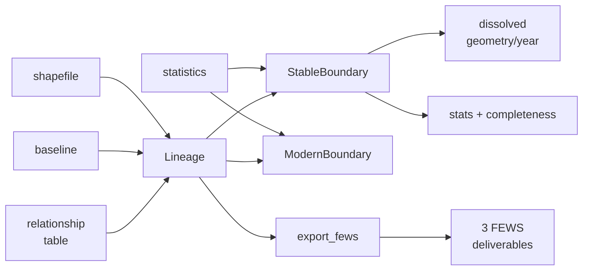

# StableBound — worked examples

Examples covering the package's main operations: reading a lineage, building the
two boundary products, reading the completeness fields, name matching, lineage
validation, input assessment, legacy FEWS relationship tables, and the FEWS
upload deliverables.

Code and output below are taken from an actual run against this repository.
Sections 1–4 use Exampleland, the five-unit synthetic country under
`examples/exampleland/`. Sections 5–9 use a second synthetic country,
`legacy_admin1`, which ships with the test suite in two dialects: the canonical
files under `tests/fixtures/synthetic/legacy_admin1/` and a hand-authored FEWS
relationship table at `tests/fixtures/rt_convert/relationshiptable_XX.csv`.
Nothing here needs external data.

API reference and methodology are in [`../docs/`](../docs/); installation and a
short quickstart are in [`../README.md`](../README.md).

| | |
|---|---|
| Problem | units split, merge and are renamed, so statistics are not directly comparable across years |
| Products | *stable* — aggregate onto boundaries that did not move · *modern* — redistribute onto present-day boundaries |
| Inputs | a relationship table, a baseline, a shapefile, a statistics file |
| Outputs | dissolved geometry per year, aggregated statistics with completeness fields, FEWS upload deliverables |

---

## 1. Snapshots and the event-year convention

Administrative units split, merge and are renamed over time. A unit's statistics
are therefore not directly comparable across years, and a shapefile from one year
does not describe the units that reported in another. `Lineage.snapshot(year)`
returns the units in force at a given year and the names they carried then.

Exampleland's five events, between two census years:



```python
from pathlib import Path
from stablebound import Lineage

EX = Path("examples/exampleland")
ln = Lineage("EX",
             relationship_table_path=EX / "relationship_table.csv",
             baseline_path=EX / "baseline.csv")

print(ln.snapshot(2010))
print(ln.snapshot(2020))
```

```
unit_id unit_name  year          unit_id       unit_name  year
  E.001     Alpha  2010            E.002           Bravo  2020
  E.002     Bravo  2010            E.003 Charlie Renamed  2020
  E.003   Charlie  2010            E.011     Alpha North  2020
  E.004     Delta  2010            E.012     Alpha South  2020
  E.005      Echo  2010            E.013       DeltaEcho  2020
```

Between those two years Alpha split in two, Charlie was renamed, and Delta and
Echo merged. Only Bravo is unchanged. `snapshot(year)` is the ground truth for
"which units existed, and what were they called" — and it is the object every
other part of the package is built on.

> [!IMPORTANT]
> **Event-year convention.** `event_year = T` means the change occurred during
> year T. The parent remains in `snapshot(T)`; children first appear in
> `snapshot(T+1)`. A FEWS vintage labelled V corresponds to `snapshot(V+1)` — a
> file-naming convention rather than an offset error, established against a
> distributed FEWS relationship table whose vintages matched at V+1 and no other
> offset, and pinned by the legacy-dialect fixture used in sections 8–9.

---

## 2. Building stable boundaries



```python
from stablebound import Lineage, StableBoundary

ln.attach_shapefile(EX / "modern.geojson")

sb = StableBoundary(ln, target_year=2010, max_year=2020, output_dir="out")
sb.build_boundaries()
sb.aggregate_stats(stats=EX / "stats.csv")

print(sb.summary())
```

```
{'_schema': 3, 'country_code': 'EX', 'n_events': 5, 'n_stable_groups_at_base': 4,
 'n_modern_units': 5, 'n_unmatched_features': 0, 'year_range': [2010, 2020]}
```

A stable boundary is a set of polygons whose extent did not change across the
requested window; units that split or merged within it are grouped together so
the group total is comparable year to year. Exampleland's five modern units
resolve to four groups, because Delta and Echo merged. `out/` contains a
dissolved GeoJSON per year, `stats_aggregated.csv`, and `remap.json` — the
`unit_id → stable_id` mapping the aggregation is derived from.

---

## 3. The stable and modern products

The package produces two products from the same inputs. The stable product
aggregates statistics onto boundaries that did not move; the modern product
redistributes them onto present-day boundaries. Both conserve the input total.

```python
from stablebound import ModernBoundary

mb = ModernBoundary(ln, output_dir="out_modern")
mb.aggregate_stats(stats=EX / "stats.csv")

stable = sb.get_stats()
modern = mb.get_modern_stats()
```

```
=== stable, rice_area_ha 2020 ===        === modern, rice_area_ha 2020 ===
stable_id  value                          modern_id  value  n_sources
    E.001    100                              E.002   80.0          1
    E.002     80                              E.003   90.0          1
    E.003     90                              E.011   60.0          1
    E.004     80                              E.012   40.0          1
                                              E.013   80.0          1

4 stable groups, total 350            5 modern units, total 350
```

The totals agree; the geography differs. The stable product keeps Alpha whole as
`E.001`; the modern product reports its two halves separately as `E.011` and
`E.012`.

> [!NOTE]
> Modern output contains both `Annual` and `Total Year` season rows. Filter to one
> season before summing, or totals will double.

---

## 4. Completeness fields

Each aggregated row records how many units contributed to it and how many were
expected to. The expected set is the strict `snapshot(year)` for the group's
members.

```python
agg = sb.get_stats()
agg[agg["completeness"] < 1.0]
```

```
year  variable      stable_id  value  n_constituents  n_in_group  completeness  complete  missing_unit_ids  constituent_ids
2018  rice_area_ha      E.004     80               1           2           0.0     False       E.004,E.005            E.013
```

The 2018 value is the same magnitude as its neighbours and carries no indication
in the value itself that anything is unusual. Delta and Echo merged into DeltaEcho
during 2018; both parents remained in the 2018 snapshot and neither reported. The
only contributor was `E.013`, the child, which reported a year before it entered
the snapshot. The completeness fields are the only record of this.

| column | answers |
|---|---|
| `n_constituents` | how many units actually contributed |
| `n_in_group` | how many *should* have, from a strict `snapshot(year)` |
| `completeness` | `(n_in_group − missing) / n_in_group` |
| `complete` | subset test, so it can never disagree with `missing_unit_ids` |
| `missing_unit_ids` | exactly which ones are absent |

For a whole-dataset view:

```python
sb.completeness_report()
```

```
    variable  year  n_cells  n_complete  pct_complete  mean_completeness  min_completeness  worst_ids
rice_area_ha  2010        4           4           1.0                1.0               1.0  E.001,E.002,E.003
rice_area_ha  2015        4           4           1.0                1.0               1.0  E.001,E.002,E.003
```

Also written to `completeness_report.csv` on every run.

---

## 5. Name matching and the proposal

Shapefile and statistics names generally do not match lineage names exactly. The
matcher returns a `MatchProposal` — a per-row table of proposed assignments with
the method and score that produced each one — which can be written to CSV for
review before it is applied. Here the synthetic country's modern file has two
names altered by hand: a typo (`Alpha Nrth`) and a longer official form
(`Bravo-Delta Province`).

```python
import geopandas as gpd
from stablebound import Lineage

SYN = Path("tests/fixtures/synthetic/legacy_admin1")
xx = Lineage("XX", relationship_table_path=SYN / "lineage.csv",
             baseline_path=SYN / "baseline.csv")
gdf = gpd.read_file(SYN / "modern.geojson")      # then two names edited by hand

proposal = xx.propose_shapefile_mapping(gdf, name_column="unit_name")
print(proposal.summary())
proposal.to_csv("mapping.csv")     # edit by hand, then pass back in
```

```
Total source rows:   4

Match counts by method:
  homonym     0
  exact       2
  manual      0
  fuzzy       1
  unmatched   1

Sketchy fuzzy matches (score < 0.9): 0

Year-remapped rows (aligned to an OLDER/ancestor unit — VERIFY these are not mis-attached to a defunct unit): 0

Unmatched rows: 1
  idx=2     src='Bravo-Delta Province'               best='BravoDelta' (score=0.67)
```

The typo is caught by the fuzzy pass at 0.95; the longer form scores 0.67 and is
left unmatched with its closest candidate named, rather than guessed. Aliases are
supplied through `manual_overrides`, whose values are lineage *names* rather than
unit ids; an override naming a target absent from the snapshot raises a warning
rather than failing silently.

For statistics, `propose_stats_mapping(..., year_aware=True, year_column="year")`
matches each name against the snapshot for its own year, and walks up the lineage
when a name resolves to a unit that did not exist in that year. Such remaps are
recorded in the `method` column and listed by `MatchProposal.remapped`.

---

## 6. Lineage validation

Eight checks run when a lineage is loaded. They raise rather than warn, because
the failure modes they cover produce plausible output rather than errors. The
example below is a unit created and consumed within the same event year.

```python
from stablebound import validate_lineage, format_issues
from stablebound.lineage import LineageGraph

bad = pd.DataFrame([
    (1983, "Split",        "A", "A", "T",  "T"),    # T created …
    (1983, "Redistribute", "T", "T", "C1", "C1"),   # … and consumed, same year
    (1983, "Redistribute", "T", "T", "C2", "C2"),
], columns=["event_year","event_type","parent_id","parent_name","child_id","child_name"])

print(format_issues(validate_lineage(LineageGraph.from_dataframe(bad, validate=False))))
```

```
[ERROR #1] transient_unit
  unit 'T' is both created and consumed in 1983, so it never exists in any
  snapshot on its own
  → Per-year snapshot updates are atomic, so this id is removed and re-added in
    the same step and stays alive indefinitely alongside its successors
    ['C1', 'C2'] — double-counting their territory in every later year.
```

This check was added after the pattern was found over a hundred times in a
machine-generated lineage, where it inflated one year's unit count by more than a
quarter.

---

## 7. Input assessment

`assess_country` examines the four input files and returns a graded report.
Sections grade PASS, WARN, FAIL or SKIP, and the overall grade is the worst of
them. Absent inputs grade SKIP rather than failing, so the function is usable
with only a lineage in hand. The same edited shapefile as in section 5:

```python
from stablebound import assess_country

report = assess_country(
    relationship_table=SYN / "lineage.csv", baseline=SYN / "baseline.csv",
    shapefile=gdf, shapefile_name_column="unit_name",
    country="Exampleland", admin_level=1,
)
print(report)
```

```
==================================================================
StableBound readiness: Exampleland
==================================================================

[PASS]  Relationship table dialect
         canonical format, 5 row(s)

[PASS]  Lineage health
         clean (5 events)

[PASS]  Baseline coverage
         4 baseline unit(s) at 2010, events 2015-2025

[FAIL]  Shapefile match
         3/4 matched (75%)
           - exact 2, fuzzy 1, unmatched 1
           - unmatched names include: ['Bravo-Delta Province']

[----]  Statistics match
         no statistics supplied

[----]  Completeness forecast
         needs statistics with a year column

[PASS]  FEWS exportability
         admin level 1
           - 7 unit(s) fit the 2-character code space (capacity 100)

------------------------------------------------------------------
OVERALL: FAIL

Fix before running:
  * Shapefile match: 3/4 matched (75%)
==================================================================
```

One unmatched name in four is a 75% match rate, which the report grades FAIL and
names first under "Fix before running". The FEWS section reports code-space
capacity, so an overflow is identified before the deliverables are written. The
shapefile section also compares the feature count against the expected snapshot
size and reports a large discrepancy as a probable admin-level mismatch — a
regions file supplied for a provinces lineage otherwise appears as a near-zero
match rate.

---

## 8. Legacy FEWS tables and FNID joins

The package reads both the canonical schema and the legacy 11-column FEWS
dialect, and identifies which it has been given. Conversion also returns the
FNID-to-unit_id mapping recovered from the table. The fixture
`relationshiptable_XX.csv` is the synthetic country of section 5 written in that
dialect by hand (see the README beside it).

```python
from stablebound import detect_dialect

XX = Path("tests/fixtures/rt_convert/relationshiptable_XX.csv")
detect_dialect(pd.read_csv(XX))     # -> 'legacy'

xx = Lineage.from_legacy_rt(XX, country="XX", admin_level=1)
```

```
events   : 5
baseline : 4 units at 2010
fnid_map : 18 FNIDs -> unit_ids
sample   : [('XX2010A101', 'XX.ADM1.00001'), ('XX2010A102', 'XX.ADM1.00002')]
```

Statistics from FEWS-sourced countries commonly carry an `FNID` column, which
makes the following an exact join and removes the name-matching step:

```python
stats = xx.attach_stats_by_fnid(stats, fnid_column="FNID")
```

```
      FNID  year  value       unit_id
XX2010A101  2010    1.0 XX.ADM1.00001
XX2015A105  2016    2.0 XX.ADM1.00005
XX2020A103  2021    3.0 XX.ADM1.00003
```

The three FNIDs come from three different vintages and resolve to three units,
one of them (`XX2020A103`) through a rename. On a real country this step has
resolved tens of thousands of rows with no aliases; India, whose statistics carry
no FNIDs, needed name matching with several dozen hand-curated aliases instead.

> [!NOTE]
> A resolved percentage combines two different conditions. A row carrying no FNID
> is a gap in the source; an FNID absent from the lineage indicates a vintage
> mismatch between the statistics and the relationship table. Only the second is
> addressable by changing the lineage, and the two are reported separately.

---

## 9. FEWS deliverables

```python
res = xx.export_fews("fews_out", years=range(2010, 2027), admin0="Exampleland",
                     legacy_relationship=True)
```

```
admin_definitions   ['XX_Admin_Definitions_2010.xlsx', 'XX_Admin_Definitions_2011.xlsx', '...', 'XX_Admin_Definitions_2026.xlsx']
relationship        ['XX_GeographicUnitRelationship.csv']
legacy_relationship ['relationshiptable_XX.csv']
```

Passing `stats=` adds the AgStats workbook. `legacy_relationship=True` writes the
11-column dialect alongside the upload files, which allows the export to be
round-trip tested: re-imported, the synthetic country reproduces its events and
baseline year, and India — over a thousand events across two admin levels —
reproduces the unit name set for every year. Ids are not preserved on a round
trip, since conversion reassigns them. The legacy file written here has the same
vintage structure as the hand-authored one in section 8:

```
category      relationship_type
hierarchical  admin1_0             18
temporal      merge                 2
              name change           1
              split                 2
              successor            10
```

---

## 10. Directory contents

| location | what it demonstrates |
|---|---|
| `exampleland/` | the five-unit synthetic country of sections 1–4; `run_pipeline.py` runs both products on it end to end |
| `../tests/fixtures/synthetic/legacy_admin1/` | the second synthetic country (sections 5–9): a split, a same-id rename and a merge, in canonical form |
| `../tests/fixtures/rt_convert/relationshiptable_XX.csv` | the same country in the legacy FEWS dialect, hand-authored; its README explains the row blocks |
| `../tests/fixtures/synthetic/` | ten more small countries, one hazard each (cascade, redistribute, homonyms, diacritics, late reporting, ...); `test_qualification.py` runs one invariant battery across all of them |
| `../tools/india/` | how the bundled India lineage and the shipped shapefile ids are regenerated from their canonical sources (needs the source data tree) |

---

## 11. Scope and limitations

- `reconcile_mode` accepts only `"off"`. The reconciliation module is
  implemented but not wired in: its merge mode removed legitimate post-event
  child rows in most flagged India cases.
- FEWS export supports admin levels 1 and 2. Level 3 and deeper raise
  `NotImplementedError`, as the FNID code width for those levels is unconfirmed.
- Breakpoint analysis (`analyze_breakpoints`) requires the optional `Rbeast`
  dependency: `pip install stablebound[analysis]`.
- An admin-2 country requires `coarse_id` and `coarse_name` on its baseline;
  without them `export_fews` raises, as the admin-1 tab cannot be derived.

## Reproducing the outputs

```bash
python examples/exampleland/run_pipeline.py     # sections 2-4, end to end
pytest -q                                       # the full suite, about 600 tests
python tools/india/bundle_data.py --check       # bundled India data matches the canonical sources
                                                # (needs STABLEBOUND_DATA_ROOT; not runnable from a bare clone)
```

Sections 5–9 are reproduced by `tests/test_match.py`, `tests/test_assess.py`,
`tests/test_rt_convert.py`, `tests/test_fnid_join.py` and
`tests/test_legacy_relationship.py` on the same fixtures.
